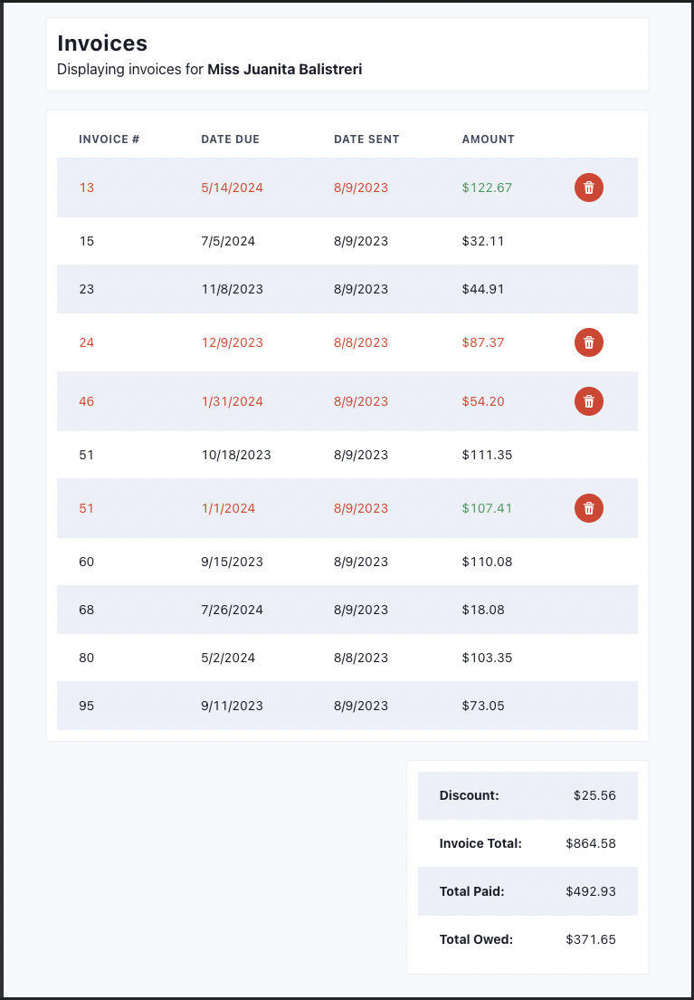
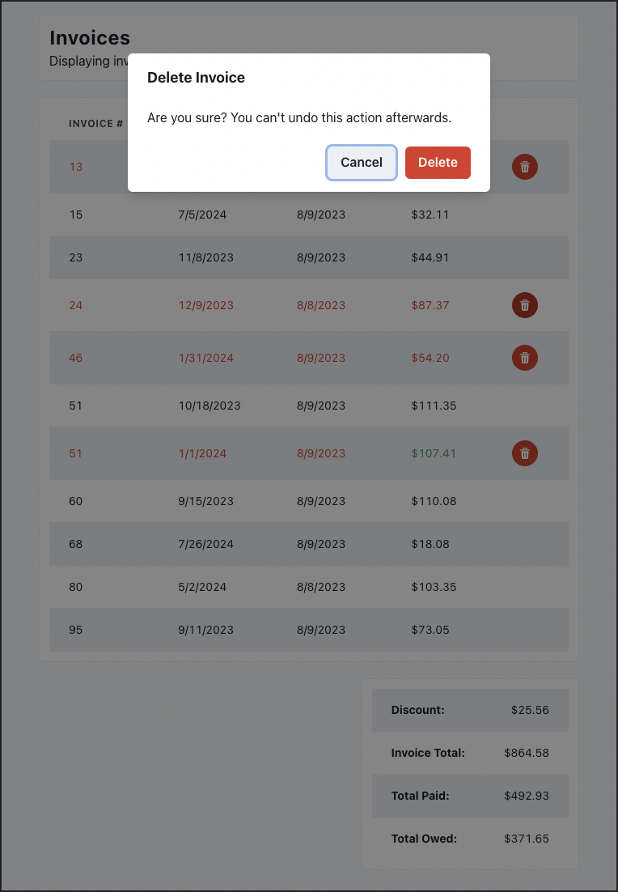

# SG Technical Test

---

```bash
# Install packages
yarn
# Run dev server
yarn dev
```

Open [http://localhost:3000](http://localhost:3000) with your browser to see the result.

---
## Task
We have set up this partial simple invoice project for you to complete. 
Below is a list of tasks that we would like you to complete.

The tech stack is simple, using what we normally use on our projects, [NextJS](https://nextjs.org/docs) and [Chakra](https://chakra-ui.com/docs/components) for the UI.

You are free to add any other additional packages you require and can edit/refactor any of the existing code to complete any of the tasks.


- [X] The `/api/invoices` is incomplete, please add the following:
  - [X] Sort the api by invoice number
  - [X] Add a discount of 10% to all invoices that are unpaid and are more than $100 in total (price on the invoice is in cents)
  - [X] Make sure that if there are no results that an appropriate status code is sent back
  - [X] Create a test for the API and test all cases

- [X] Add an `Amount` column to table to display the total value of the invoice

- [X] Calculate the totals for `Invoice Total`, `Total Paid` and `Total Owed`

- [X] Add a feature that enables the user to delete invoices that have not been paid, user should get a prompt to confirm before deleting the item

- [X] Format all dates `dd-mm-yyyy` 

- [X] Currency is give in cents, format them as `$00.00`

- [X] Highlight alternate rows

- [X] Highlight table rows with unpaid invoices in red

- [X] Fix the table with the totals to look like the one designed, floating to the right

- [X] If there is a discount, display the discounted price in the table and highlight the amount in green.

- [X] Add the `Discount` to the totals table at the bottom panel

- [X] Mobile - fix the invoice # column to be sticky on the left side when table scrolls horizontally 

---
## Designs


